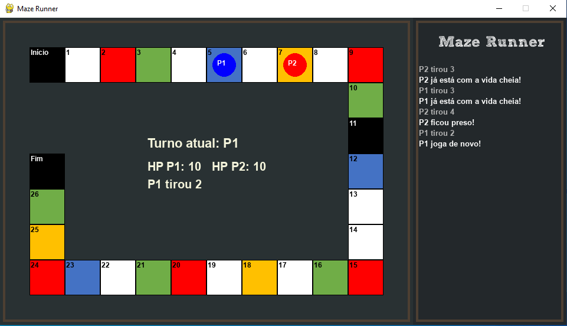

# 🏃‍♂️ The Maze Runner - Jogo de Tabuleiro Eletrônico

[](https://www.python.org/)
[](https://www.pygame.org/)



Um jogo de tabuleiro eletrônico competitivo para dois jogadores, desenvolvido como projeto final para a disciplina de **Introdução à Programação (IP)**, alcançando a **nota máxima (10/10)**. 

O projeto simula um labirinto dinâmico e estratégico utilizando a biblioteca **Pygame**, contando com uma interface gráfica customizada, efeitos sonoros imersivos e lógica de turnos automatizada.

---

## 👥 Equipe (Lazarus)
* [Wendel Lucas](https://www.linkedin.com/in/wendel-freitas-760178388/)
* [Vitor Miguel](https://www.linkedin.com/in/vitor-miguel-vtrmgl)
* [Miguel Maelbe](https://www.linkedin.com/in/miguel-maelbe/)

---

## 🎲 Sobre o Jogo & Mecânicas

O objetivo de cada jogador é cruzar o labirinto e chegar vivo até a casa **Fim**. O tabuleiro é composto por 28 casas (de 0 a 27) coloridas, onde cada cor engatilha um efeito ou penalidade direta sobre a vida (HP) ou o turno do jogador.

### 📋 Regras de Funcionamento
1. **Atributos Iniciais:** Ambos os jogadores começam na célula `Início` com **10 pontos de vida (HP)**. O HP máximo é limitado a 10.
2. **Definição de Ordem:** No início da partida, ambos os jogadores rolam dados de 1 a 6. Quem obtiver a maior soma inicia o jogo. Em caso de empate, os dados são rolados novamente.
3. **Movimentação:** Na sua vez, o jogador rola 1 dado, e o valor define a quantidade de casas a avançar.
4. **Condição de Vitória:** Vence quem alcançar a casa **27 (Fim)** primeiro **OU** se o HP do adversário chegar a 0 (vitória por sobrevivência).

### 🎨 Efeitos das Casas (Cores)
* ⬜ **Branca (Espaço Neutro):** Sem ações sobre o jogador.
* 🟥 **Vermelha (Penalidade):** O jogador perde **3 pontos de HP**.
* 🟩 **Verde (Cura):** O jogador recupera **1 ponto de HP** (respeitando o limite máximo de 10).
* 🟨 **Amarela (Prisão):** Aprisiona o jogador, fazendo-o **perder 1 turno**.
* 🟦 **Azul (Turno Extra):** Permite que o jogador **jogue novamente** de imediato.
* ⬛ **Preta (Armadilha):** Faz o jogador **voltar imediatamente para o Início** (casa 0).

---

## 🛠️ Tecnologias e Recursos Utilizados
* **Linguagem Principal:** Python 3
* **Biblioteca Gráfica e de Áudio:** Pygame
* **Destaques do Código:**
  * Painel lateral de logs atualizado em tempo real para acompanhar o histórico das jogadas.
  * Sistema de som dedicado (sons distintos ao tirar dados, sofrer dano, curar, ficar preso, resetar e vencer).
  * Prevenção de sobreposição visual de peões quando os jogadores ocupam a mesma casa.

---

## 🎮 Controles do Jogo

O jogo é controlado inteiramente pelo teclado de forma compartilhada:

* **Jogador 1 (P1 - Azul):** Usa a tecla `ESPAÇO` para rolar os dados.
* **Jogador 2 (P2 - Vermelho):** Usa a tecla `ENTER` (Return) para rolar os dados.
* **Fase de Inicialização:** Pressionar `TAB` após ambos rolarem os dados iniciais para confirmar quem começa.

---

## 🚀 Como Executar o Projeto

### Pré-requisitos
Certifique-se de ter o Python 3 e o gerenciador de pacotes `pip` instalados. É necessário possuir a biblioteca `pygame` e os arquivos de áudio/fonte na mesma pasta do código.

1. **Instale o Pygame:**
   ```bash
   pip install pygame
